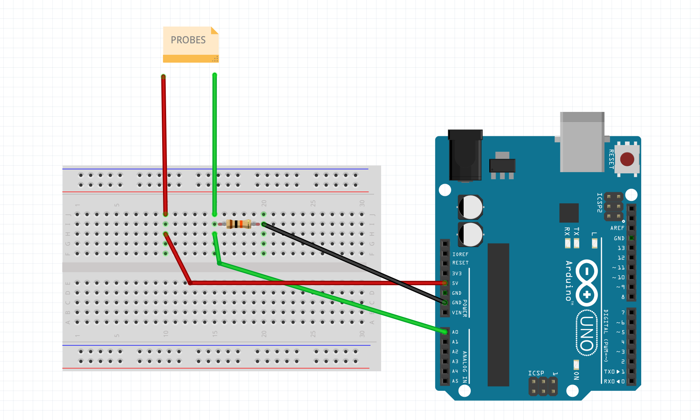
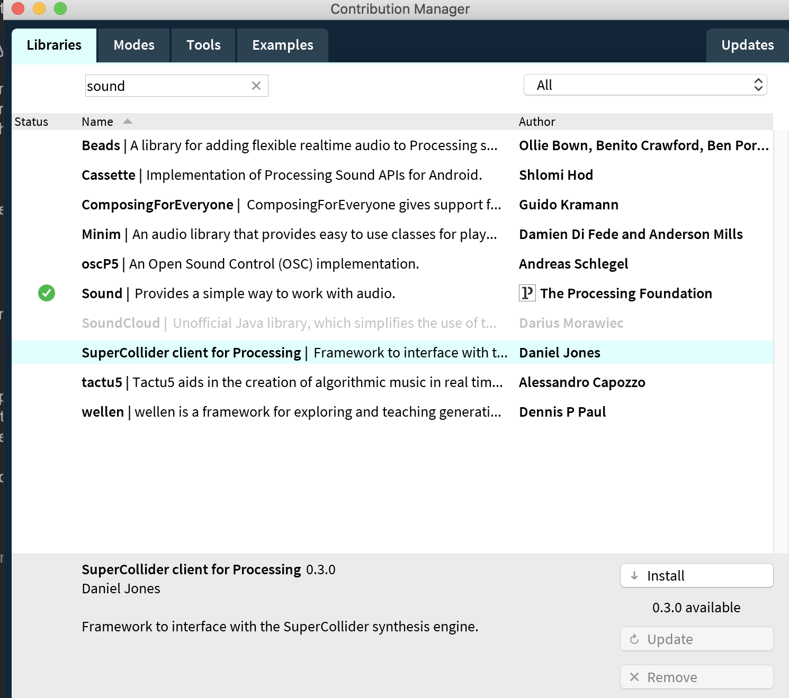

# BioData Processing

This is repository holds the documentation of the BioData Exploration with arduino, by Danilo Vaz: https://github.com/dnllvrvz/BioData-Exploration

It's a simple technique to capture the electric fingerprint of plants and mushrooms and use the data to create sonification and visualizations of this fingerprint. Code and data samples are provided in the respective folders.

In the video's at the bottom the process and results are shown in more detail.

**Sonification example**

<iframe width="560" height="315" src="https://www.youtube.com/embed/gehPyChgocY" title="YouTube video player" frameborder="0" allow="accelerometer; autoplay; clipboard-write; encrypted-media; gyroscope; picture-in-picture" allowfullscreen></iframe>

**Code**

Contains code to save sensordata into a .csv file (*Arduino\_save\_data* and *Processing\_save\_data*). 

And code to visualize and sonify data in a .csv file (*Processing\_visualize\_data*)

**Samples**

The samples folder contants pre-made .csv files to play with.

## Step 1: record biodata

### Arduino Setup

Here's a picture of the initial circuit used for the collection of the data in this exploration. It has been inspired by [this project](https://www.youtube.com/watch?v=8ogMm94AH80) by Build It.

The only difference between this drawing and the actual setup that I have been using is that I have an Arduino Uno, instead of an Arduino Nano. But for the purpose of this project that doesn't change anything.



Tip: make the probes from a longer wire so you have some more space to move.

### The code to record the data to a .csv

To save the data to a .csv we will use both Arduino and Processing. The code is in the folders *Arduino\_save\_data* and *Processing\_save\_data*. 

#### Arduino save data code 

This code simply reads values between pin A0 and 5V where your probes and the 10K voltage divider are. It prints it to the serial monitor. We'll then use Processing to pick the data from the serial and store it into a file, see next.

Make sure your serial monitor is set to a baud rate of 9600. 

```
// THIS CODE GOES ON THE ARDUINO IDE:
// Make sure to adjust your Arduino Port and Board settings on "Tools".

void setup() {
  Serial.begin(9600);
}

void loop() {
  Serial.println(analogRead(A0));
  delay(20);
}

```

#### Processing save data code 

The Processing code initiates a serial port, and saves the incoming values in the float called *inByte*. It checks for new data and stores it to a file called *new.csv* (or change it to something else on line 65). The file will be generated in the folder of the processing sketch.

**Setup**

* Find the address of your serial port in the Arduino IDE: with the board connected, go to > Tools > Port and copy the address of the active port into the Processing sketch in line 23. On mac computer, it usually starts with */dev/cu.usbmodem...* 
* Change the target file name of the .csv file so it doesn't overwrite, by changing the name *new.csv* to something else on line 65 in the Processing sketch. 
* Run both sketches at the same time for a minute, and check if you got any data in your .csv file. 


```
import processing.serial.*;

Serial myPort;        // The serial port
float inByte;         // Incoming serial data
boolean newData = false;
int xPos = 1;         // horizontal position of the graph 
int scale = 50;        // Adjust visual scale of map

Table registros;

//Variables to draw a continuous line.
int lastxPos=1;
int lastheight=0;

void setup () {
  // set the window size:
  size(800, 600);        

  //Make sure this is the sabe port as the one in the Arduino setup
  myPort = new Serial(this, "/dev/cu.usbmodem1421", 9600); 

  // A serialEvent() is generated when a newline character is received :
  myPort.bufferUntil('\n');
  background(0);      // set inital background:
  
  registros = new Table();
  registros.addColumn("entry");
  registros.addColumn("values");
}
void draw () {
  if (newData) {
    // map data to fit screen
    float DrawData = map(inByte, 0, scale, 0, height);
    println (inByte, DrawData);
    
    //Drawing a line from Last inByte to the new one.
    float c = map(DrawData, 0, height, 0, 700);
    stroke(255, c, 0);     //stroke color
    strokeWeight(1);        //stroke wider 
    line(lastxPos, lastheight, xPos, height - DrawData); 
    
    lastxPos= xPos;
    lastheight= int(height - DrawData);

    // at the edge of the window, go back to the beginning:
    if (xPos >= width) {
      xPos = 0;
      lastxPos= 0;
      background(0);  //Clear the screen.
    } 
    else {
      // increment the horizontal position:
      xPos++;
    }
    
    //Table updating
    TableRow newRow = registros.addRow();
    newRow.setInt("entry", registros.lastRowIndex() + 1);
    newRow.setFloat("values", inByte);
    
    //Table saving
    saveTable(registros, "data/new.csv");
    
   newData =false;
 }
}

void serialEvent (Serial myPort) {
  // get the ASCII string:
  String inString = myPort.readStringUntil('\n');
  if (inString != null) {
    //print (inString);
    inString = trim(inString);                // trim off whitespaces.
    inByte = float(inString);           // convert to a number.
    newData = true; 
  }
}

```


## Step 2: Sonify/visualize the data


### Copy your .csv file to the new Processing sketch folder

Rename your file if needed, best is only lower case, no spaces. Make sure it has the extension .csv. Place or copy this file to the *Processing\_visualize\_data* folder where the visualization sketch also resides. 

Open the Processing sketch *Processing\_visualize\_data* to play with your data. The file name on line 23 should be updated to match the name of your own .csv file. 

### Install the sound library for Processing

If you don't have it already, install the .sound library: 
\> Sketch > Import library > Add library
 Then search for "Sound"
 
 

If it's already installed it will have a green check mark next to it. If not, select it and click Install. 

### Design your visualization & sonification of the data

That's it. You can play with the example visualization and start designing your own. Examples for several visualization strategies can be found on https://processing.org

## Additional information

Here's a playlist where Danilo Vaz explains the setup and show examples of its functioning: https://www.youtube.com/playlist?list=PLgduvfqJa2lOS8xUoFPziR5fBI0N4Owao

**Biodata Demo by Danilo Vaz**

<iframe width="560" height="315" src="https://www.youtube.com/embed/9ZPAXOsJjoM" title="YouTube video player" frameborder="0" allow="accelerometer; autoplay; clipboard-write; encrypted-media; gyroscope; picture-in-picture" allowfullscreen></iframe>

**Hardware set up**

<iframe width="560" height="315" src="https://www.youtube.com/embed/OK37mIi7nd8" title="YouTube video player" frameborder="0" allow="accelerometer; autoplay; clipboard-write; encrypted-media; gyroscope; picture-in-picture" allowfullscreen></iframe>

**Plant biodata**

<iframe width="560" height="315" src="https://www.youtube.com/embed/Wz170WHri6c" title="YouTube video player" frameborder="0" allow="accelerometer; autoplay; clipboard-write; encrypted-media; gyroscope; picture-in-picture" allowfullscreen></iframe>

**Mushroom biodata**

<iframe width="560" height="315" src="https://www.youtube.com/embed/ccpS1AEKhNM" title="YouTube video player" frameborder="0" allow="accelerometer; autoplay; clipboard-write; encrypted-media; gyroscope; picture-in-picture" allowfullscreen></iframe>

**Sonification example**

<iframe width="560" height="315" src="https://www.youtube.com/embed/gehPyChgocY" title="YouTube video player" frameborder="0" allow="accelerometer; autoplay; clipboard-write; encrypted-media; gyroscope; picture-in-picture" allowfullscreen></iframe>